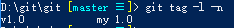
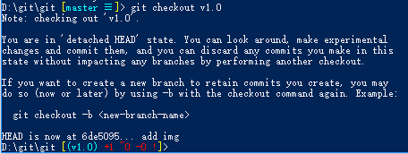

# Git1.0

## 配置

*  安装 Git 之后，你要做的第一件事情就是去配置你的名字和邮箱，因为每一次提交都需要这些信息

```
git config --global user.name "bukas"
git config --global user.email "bukas@gmail.com"
```
这种配置属于用户变量配置，配置文件存放在用户目录下。例如windows xp存放在：C:\Documents and Settings\$USER\.gitconfig

* 配置存储用户名和密码

```
$ git config credential.helper store
```
在用户目录下生成.git-credentials文件

* 获取Git配置信息，执行以下命令

```
git config --list
```

## Git GUI

Git GUI是git封装了命令行的图形用户界面工具，下载安装之后可以结合Git Shell一起使用

## 创建仓库

```
mkdir mygit //创建mygit目录
cd mygit	//进入目录
git init	//初始化仓库
```

通过git init命令将生成一个隐藏的.git目录，该目录文件承担了版本控制的功能

## 工作区和暂存区

Git和其他版本控制系统如SVN的一个不同之处就是有暂存区的概念。工作区就是你在电脑里能看到的目录，比如我的`testgit`文件夹就是一个工作区。工作区有一个隐藏目录`.git`，这个不算工作区，而是Git的版本库。Git的版本库里存了很多东西，其中最重要的就是称为`stage`（或者叫`index`）的暂存区，还有Git为我们自动创建的第一个分支`master`，以及指向 `master`的一个指针叫`HEAD`。前面讲了我们把文件往 Git 版本库里添加的时候，是分两步执行的：

* 用`git add`把文件添加进去，实际上就是把文件修改添加到暂存区；
* 用`git commit`提交更改，实际上就是把暂存区的所有内容提交到当前分支。

因为我们创建Git版本库时，Git自动为我们创建了唯一一个`master`分支，所以现在`git commit`就是往`master`分支上提交更改。你可以简单理解为，`git add`命令实际上就是把要提交的所有修改放到暂存区（Stage），然后执行`git commit`就可以一次性把暂存区的所有修改提交到分支。一旦提交后，如果你又没有对工作区做任何修改，那么工作区就是“干净”的。

## commit文件

```
touch readme.md		//生成md文件
git add readme.md	//添加md文件到版本库
git commit -m "wrote a readme file" //提交文件，-m后面输入的是本次提交的说明
```

一次可以`add`多个不同的文件，以空格分隔：

```
git add a.txt b.txt c.txt
```

* git add . ：他会监控工作区的状态树，使用它会把工作时的**所有变化提交**到暂存区，包括文件内容修改(modified)以及新文件(new)，但不包括被删除的文件。
* git add -u ：他仅监控**已经被add的文件**（即tracked file），他会将被修改的文件提交到暂存区。add -u 不会提交新文件（untracked file）。（git add --update的缩写）
* git add -A ：是上面两个功能的合集（git add --all的缩写）

## 仓库状态

```
git status
```

`git status`命令可以让我们时刻掌握仓库当前的状态。


查看具体修改内容

```
git diff readme.md
```

## 版本日志和回退

### 基本日志

首先可以查看git日志文件：

```
git log
```


这里显示了所有commit的ID、提交人、提交时间、提交信息；`git log`命令显示从最近到最远的提交日志。如果嫌输出信息太多，看得眼花缭乱的，可以试试加上`--pretty=oneline`参数：

```
git log --pretty=oneline
```

### 完全日志

git reflog 可以查看所有分支的所有操作记录（包括commit和reset的操作），包括已经被删除的commit记录，git log则不能察看已经删除了的commit记录

```
git reflog
```

比较区别：


### 版本回退

在 Git中，用`HEAD`表示当前版本，也就是最新的提交`commit id`，上一个版本就是`HEAD^`，上上一个版本就是`HEAD^^`，当然往上100个版本写100个^比较容易数不过来，所以写成`HEAD~100`。

现在我们要把当前版本回退到上一个版本，就可以使用`git reset`命令：

```
git reset --hard HEAD^
```

或者直接指定reset到具体某一个版本，以前的版本id可以通过`git reflog`查看

```
git reset --hard 2e70fdf //版本号写前几位即可
```
## 修改与撤销

用`git diff HEAD -- readme.md`命令可以查看工作区和版本库里面最新版本的区别。

`git checkout -- file`可以丢弃工作区的修改：

命令`git checkout -- readme.md`意思就是，把`readme.md`文件在工作区的修改全部撤销，即让这个文件回到最近一次`git commit`或`git add`时的状态。

当然也可以用`git reset`命令。

## 远程服务器

本地仓库上传至远程git服务器

```
git remote add origin https://github.com/lilian132/git.git	//添加一个远程服务器，别名为origin
git push -u origin master	//push至服务器，首次push加上-u
```
## tag标签

通过tag命令，实现版本的切换和控制

### 打标签

```
git tag -a v1.0 -m "my v1.0" //-a 添加标签；v1.0标签名 -m添加说明文本
```

### 查看已有标签

```
git tag -l -n //列出所有标签信息
```



### 按标签切换版本

```
git checkout <tag-name>
```



可以看到版本已经从master 切换为 v1.0，返回目录工作区看本地文件已发生变化

切回master：`git checkout master`

### 删除标签

```
git tag -d v1.0
```

### 提交远程服务器

```
git push origin master
git push origin --tags
```

## stash备份

* git stash: 备份当前的工作区的内容，从最近的一次提交中读取相关内容，让工作区保证和上次提交的内容一致。同时，将当前的工作区内容保存到Git栈中。
* git stash pop: 从Git栈中读取最近一次保存的内容，恢复工作区的相关内容。由于可能存在多个Stash的内容，所以用栈来管理，pop会从最近的一个stash中读取内容并恢复。
* git stash list: 显示Git栈内的所有备份，可以利用这个列表来决定从那个地方恢复。
* git stash clear: 清空Git栈。此时使用gitg等图形化工具会发现，原来stash的哪些节点都消失了。

关于Git Stash的详细解释，适用场合，这里做一个说明：

使用git的时候，我们往往使用branch解决任务切换问题，例如，我们往往会建一个自己的分支去修改和调试代码, 如果别人或者自己发现原有的分支上有个不得不修改的bug，我们往往会把完成一半的代码 commit提交到本地仓库，然后切换分支去修改bug，改好之后再切换回来。这样的话往往log上会有大量不必要的记录。其实如果我们不想提交完成一半或者不完善的代码，但是却不得不去修改一个紧急Bug，那么使用'git stash'就可以将你当前未提交到本地（和服务器）的代码推入到Git的栈中，这时候你的工作区间和上一次提交的内容是完全一样的，所以你可以放心的修 Bug，等到修完Bug，提交到服务器上后，再使用'git stash apply'将以前一半的工作应用回来。也许有的人会说，那我可不可以多次将未提交的代码压入到栈中？答案是可以的。当你多次使用'git stash'命令后，你的栈里将充满了未提交的代码，这时候你会对将哪个版本应用回来有些困惑，'git stash list'命令可以将当前的Git栈信息打印出来，你只需要将找到对应的版本号，例如使用'git stash apply stash@{1}'就可以将你指定版本号为stash@{1}的工作取出来，当你将所有的栈都应用回来的时候，可以使用'git stash clear'来将栈清空。


